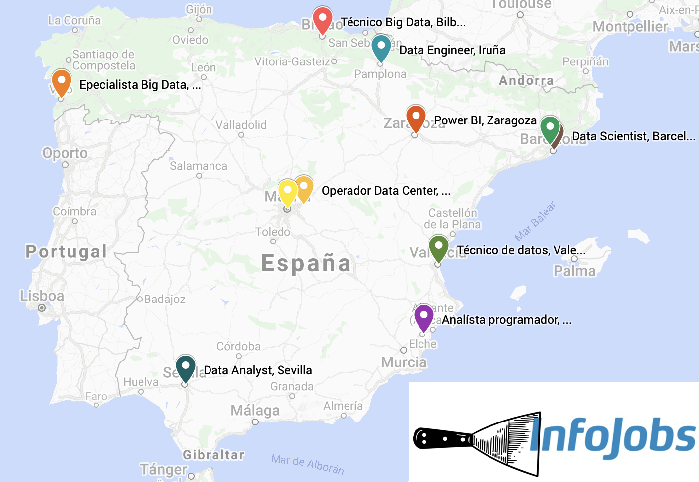

# Infojobs Scraper



***Remark: neither this repository nor its creator are related to Infojobs.***

### Descripción:

Este módulo Python tiene como objetivo poder hacer una búsqueda concreta en *Infojobs* 
y devolver un conjunto de datos con las características más relevantes de las ofertas resultado.
Es capaz de buscar unas palabras clave en Infojobs.net, 
obtener las urls con ofertas resultantes,
además de cierta información relevante, 
y crear un archivo csv.

*Infojobs* es 
(tal y como se menciona en 
[este artículo por El País](https://cincodias.elpais.com/cincodias/2021/03/11/lifestyle/1615489634_858154.html))
el mayor portal de empleo en España, 
y por lo tanto la opción idónea si queremos obtener información de las ofertas de trabajo dentro de España.

Este módulo ha sido desarrollado con fines educativos,
no comerciales. 

### Description: 

The purpose of this Python module is to, 
given some search parameters, 
retrieve the most relevant information of the answer *Infojobs* job offers.
It is now able to search some keywords in Infojobs.net, 
get the resulting urls and some info, 
and save them into a csv.

*Infojobs* is 
(as stated in 
[this article by El País](https://cincodias.elpais.com/cincodias/2021/03/11/lifestyle/1615489634_858154.html))
the main job-searching portal in Spain, 
and therefore the best option when trying to get job offer information within it.

This module has been developed for educative (non-comercial) purposes.

## Resulting dataset description: 

The name of saved csv file is composed by the given keywords and the current date and time: 
*{keywords}\_{date}\_{time}.csv*.

The following information is given about each job offer, if found: 
* `puesto`: position. 
* `empresa`: company. 
* `valoracion_empresa`: company score within Infojobs, from 1 to 100. 
* `ciudad`: the city where the offer is based. 
* `pais`: the country where the offer is based, not always Spain. 
* `tipo_contrato`: type of contract. 
* `salario`: salary. 
* `exp_minima`: expected minimum experience.
* `url`: url to the offer.

Note that the obtained data is volatile by nature. 

## Used libraries:

```
urllib
selenium
BeautifulSoup
pandas
```

### Files: 

+ **main.py**: contains the main routine. 
+ **OnePageScraper.py**: contains the code for scraping just one *Infojobs* offer.
+ **SearchPageScraper.py**: contains the code for scraping the search results pages in order to get the links to the offers. 
+ **Examples folder**: contains some examples of datasets obtained using the scraper.
+ **robots.txt**: *robots.txt* file from *Infojobs.net* at the beginning of the development of this module.

### License:

This module and the example dataset(s) are **Released Under CC0: Public Domain License**. 